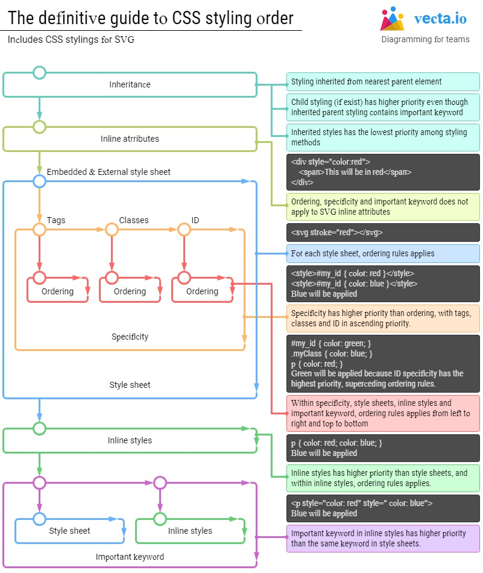

# CSS

Cascading Style Sheets (CSS) is the code you use to style your webpage. It tell the browser how to display the text and other content that you write in HTML.

There are three main ways to apply CSS styling. You can apply inline styles directly to HTML elements with the style attribute. Alternatively, you can place CSS rules within style tags in an HTML document. Finally, you can write CSS rules in an external style sheet, then reference that file in the HTML document. Prefer always the third option.

## Learn the basics

You can search for CSS Basics on [MDN](https://developer.mozilla.org/en-US/) to learn the basics, or access [here](https://developer.mozilla.org/en-US/docs/Learn/Getting_started_with_the_web/CSS_basics) to see the css basics in MDN page.

Or you can go to the "Introduction to Basic CSS" in [freecodecamp](https://learn.freecodecamp.org/responsive-web-design/basic-css).

### CSS Styling order (Precedence list)

Amazing post by Thomas Yip, Founder of vecta.io, about the subject.
You can find it [here](https://vecta.io/blog/definitive-guide-to-css-styling-order).
The image below sumarize the topic:



## Making Layouts

You can search for CSS layout on [MDN](https://developer.mozilla.org/en-US/) to learn the layout basics, or access [here](https://developer.mozilla.org/en-US/docs/Learn/CSS/CSS_layout) to see the it in MDN page.

### Positioning

```
CSS treats each HTML element as its own box, which is usually referred to as the CSS Box Model. Block-level items automatically start on a new line (think headings, paragraphs, and divs) while inline items sit within surrounding content (like images or spans). The default layout of elements in this way is called the normal flow of a document, but CSS offers the position property to override it.

Note:
Positioning gives you a lot of flexibility and power over the visual layout of a page. It's good to remember that no matter the position of elements, the underlying HTML markup should be organized and make sense when read from top to bottom. This is how users with visual impairments (who rely on assistive devices like screen readers) access your content.
```

This explanation is from [freecodecamp](https://learn.freecodecamp.org/responsive-web-design/applied-visual-design/change-an-elements-relative-position/).

#### Relative

```
When the position of an element is set to relative, it allows you to specify how CSS should move it relative to its current position in the normal flow of the page. It pairs with the CSS offset properties of left or right, and top or bottom. These say how many pixels, percentages, or ems to move the item away from where it is normally positioned. The following example moves the paragraph 10 pixels away from the bottom:

p {
  position: relative;
  bottom: 10px;
}

Changing an element's position to relative does not remove it from the normal flow - other elements around it still behave as if that item were in its default position.
```

This explanation is from [freecodecamp](https://learn.freecodecamp.org/responsive-web-design/applied-visual-design/change-an-elements-relative-position/).

#### Absolute

```
Locks the element in place relative to its parent container. Unlike the relative position, this removes the element from the normal flow of the document, so surrounding items ignore it. The CSS offset properties (top or bottom and left or right) are used to adjust the position.

It will be locked relative to its closest positioned ancestor.
```

This explanation is from [freecodecamp](https://learn.freecodecamp.org/responsive-web-design/applied-visual-design/lock-an-element-to-its-parent-with-absolute-positioning).

#### Fixed

Locks the element in place relative to the browser window. Unlike the relative position, this removes the element from the normal flow of the document, so surrounding items ignore it. The CSS offset properties (top or bottom and left or right) are used to adjust the position.

Other items no longer "realize" where it is positioned, which may require some layout adjustments elsewhere.

One key difference between the `fixed` and `absolute` positions is that an element with a fixed position won't move when the user scrolls.

This explanation is from [freecodecamp](https://learn.freecodecamp.org/responsive-web-design/applied-visual-design/lock-an-element-to-the-browser-window-with-fixed-positioning).

### Floats

### Display

### Box Model

### CSS Grid

### Flex Box

## Media Queries

You can search for Media Queries on [MDN](https://developer.mozilla.org/en-US/) to learn the layout basics, or access [here](https://developer.mozilla.org/en-US/docs/Web/CSS/Media_Queries) to see the it in MDN page.
